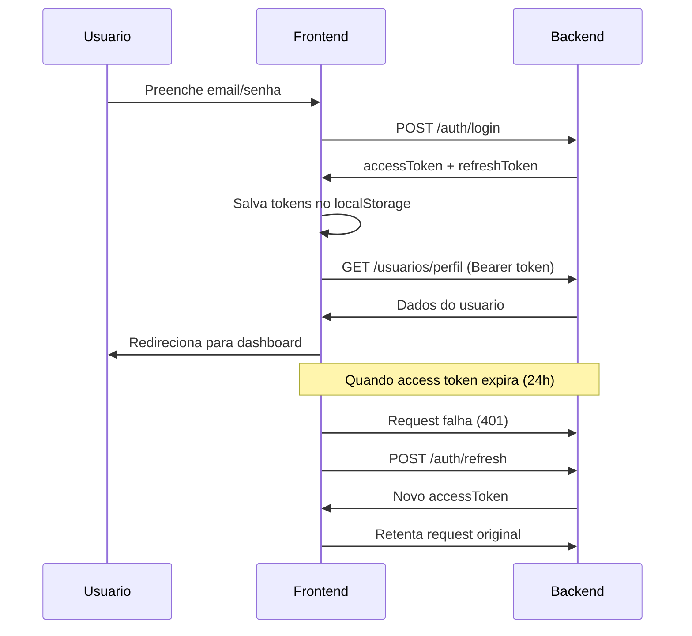

# API - Autenticacao

Todos os endpoints de autenticacao sao **publicos** (nao requerem token).

## Endpoints

### POST /auth/login

Login com email e senha.

**Request:**

```json
{
  "email": "usuario@escola.com",
  "senha": "minhasenha123"
}
```

**Response (200):**

```json
{
  "accessToken": "eyJhbGciOi...",
  "refreshToken": "eyJhbGciOi...",
  "usuario": {
    "id": "uuid",
    "nome": "Nome",
    "email": "usuario@escola.com",
    "role": "ROLE_USER",
    "escolaId": "uuid"
  }
}
```

### POST /auth/google

Login via Google OAuth. O frontend envia o `id_token` obtido da biblioteca Google OAuth.

**Request:**

```json
{
  "idToken": "eyJhbGciOi..."
}
```

**Response:** Mesmo formato do `/auth/login`.

!!! note "Nota"
    O usuario deve estar pre-cadastrado no sistema. Login com Google nao cria conta automaticamente.

### POST /auth/register

Registro de novo usuario (usado internamente pelo admin).

**Request:**

```json
{
  "nome": "Nome Completo",
  "email": "novo@escola.com",
  "senha": "senha123",
  "escolaId": "uuid"
}
```

### POST /auth/refresh

Renova o access token usando o refresh token.

**Request:**

```json
{
  "refreshToken": "eyJhbGciOi..."
}
```

**Response:**

```json
{
  "accessToken": "novo-token...",
  "refreshToken": "novo-refresh..."
}
```

### POST /auth/logout

Invalida o refresh token.

**Request:**

```json
{
  "refreshToken": "eyJhbGciOi..."
}
```

### POST /auth/forgot-password

Envia email com link de redefinicao de senha.

**Request:**

```json
{
  "email": "usuario@escola.com"
}
```

### POST /auth/reset-password

Redefine a senha usando token recebido por email.

**Request:**

```json
{
  "token": "token-do-email",
  "novaSenha": "novasenha123"
}
```

### GET /auth/validate-reset-token?token={token}

Valida se o token de reset ainda e valido.

**Response (200):**

```json
{
  "valid": true
}
```

## Fluxo de Autenticacao


