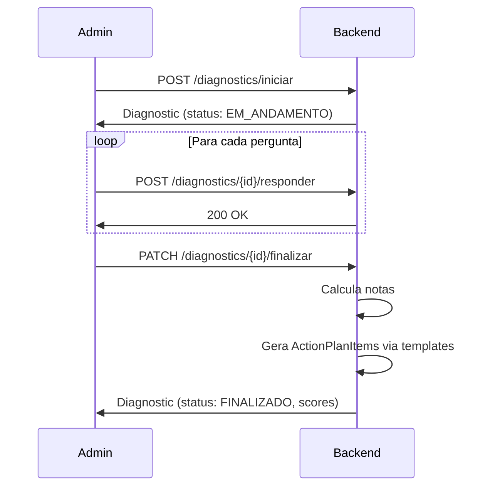

# API - Diagnóstico

## Configuração (Admin)

**Prefixo:** `/diagnostics/config`
**Autenticação:** `ROLE_ADMIN`

### GET /diagnostics/config/pillars

Retorna todos os pilares com eixos e perguntas (estrutura completa do diagnóstico).

### POST /diagnostics/config/pillars

Cria novo pilar.

### PUT /diagnostics/config/pillars/{id}

Atualiza pilar.

### POST /diagnostics/config/axes

Cria novo eixo dentro de um pilar.

### PUT /diagnostics/config/axes/{id}

Atualiza eixo.

### POST /diagnostics/config/questions

Cria nova pergunta dentro de um eixo.

**Request:**

```json
{
  "text": "A escola possui planejamento estrategico formalizado?",
  "axisId": "uuid",
  "targetAudience": "AMBOS",
  "order": 1,
  "levels": [
    { "level": 1, "description": "Nao possui planejamento" },
    { "level": 2, "description": "Possui informal" },
    { "level": 3, "description": "Possui formalizado" },
    { "level": 4, "description": "Possui com indicadores" },
    { "level": 5, "description": "Possui com revisao periodica" }
  ]
}
```

**targetAudience:** `CLUBE`, `CORP`, `START` ou `AMBOS`

### PUT /diagnostics/config/questions/{id}

Atualiza pergunta.

### DELETE /diagnostics/config/questions/{id}

Remove pergunta.

### POST /diagnostics/config/questions/{id}/duplicate

Duplica pergunta existente.

## Metodologia (Leitura)

**Prefixo:** `/methodology`
**Autenticação:** Requerida

### GET /methodology/pillars

Retorna pilares com eixos (sem perguntas — visão da metodologia para o usuário).

## Execução do Diagnóstico

**Prefixo:** `/diagnostics`
**Autenticação:** Requerida

### POST /diagnostics/iniciar

Inicia novo diagnóstico para a escola.

**Request:**

```json
{
  "escolaId": "uuid"
}
```

### GET /diagnostics/escola/{escolaId}

Lista todos os diagnósticos da escola (histórico).

### GET /diagnostics/{id}

Retorna diagnóstico com todas as respostas.

### POST /diagnostics/{id}/responder

Salva resposta de uma pergunta.

**Request:**

```json
{
  "questionId": "uuid",
  "level": 3,
  "observations": "Observacao opcional"
}
```

### PATCH /diagnostics/{id}/finalizar

Finaliza o diagnóstico. Calcula notas e gera plano de ação automaticamente.

**Response:** Diagnóstico finalizado com notas por pilar e nota geral.

### GET /diagnostics/{id}/resultados

Retorna resultados detalhados (notas por pilar, eixo, gráfico radar).

**Response (200):**

```json
{
  "diagnosticId": "uuid",
  "overallScore": 3.2,
  "pillarScores": [
    { "pillarId": "uuid", "pillarName": "Estratégia", "score": 3.5 },
    { "pillarId": "uuid", "pillarName": "Governança", "score": 2.8 }
  ],
  "clusterBenchmark": {
    "cluster": "DE_300_A_500",
    "schoolCount": 12,
    "overallAverage": 3.6,
    "pillarAverages": [
      { "pillarId": "uuid", "pillarName": "Estratégia", "average": 3.8 },
      { "pillarId": "uuid", "pillarName": "Governança", "average": 3.1 }
    ]
  }
}
```

O campo `clusterBenchmark` contém a média de notas de todas as escolas do mesmo cluster que a escola do diagnóstico. O frontend exibe essas médias como uma segunda linha no gráfico radar, permitindo que a escola se compare com seus pares.

## Fluxo do Diagnóstico



## Regras de Negócio

- Perguntas filtradas por `targetAudience` de acordo com o tipo de contrato da escola
- Perguntas `AMBOS` aparecem para todos os contratos
- Nota geral = média ponderada das notas dos pilares
- Nota do pilar = média das notas dos eixos
- Nota do eixo = média dos níveis respondidos nas perguntas
- Diagnósticos já respondidos não são afetados por alterações nas perguntas (versionamento)
- Resultados incluem benchmark de cluster: média de notas de escolas do mesmo `Cluster` (enum) sobrepostas no radar
- Benchmark calcula apenas diagnósticos finalizados de escolas ativas do mesmo cluster
