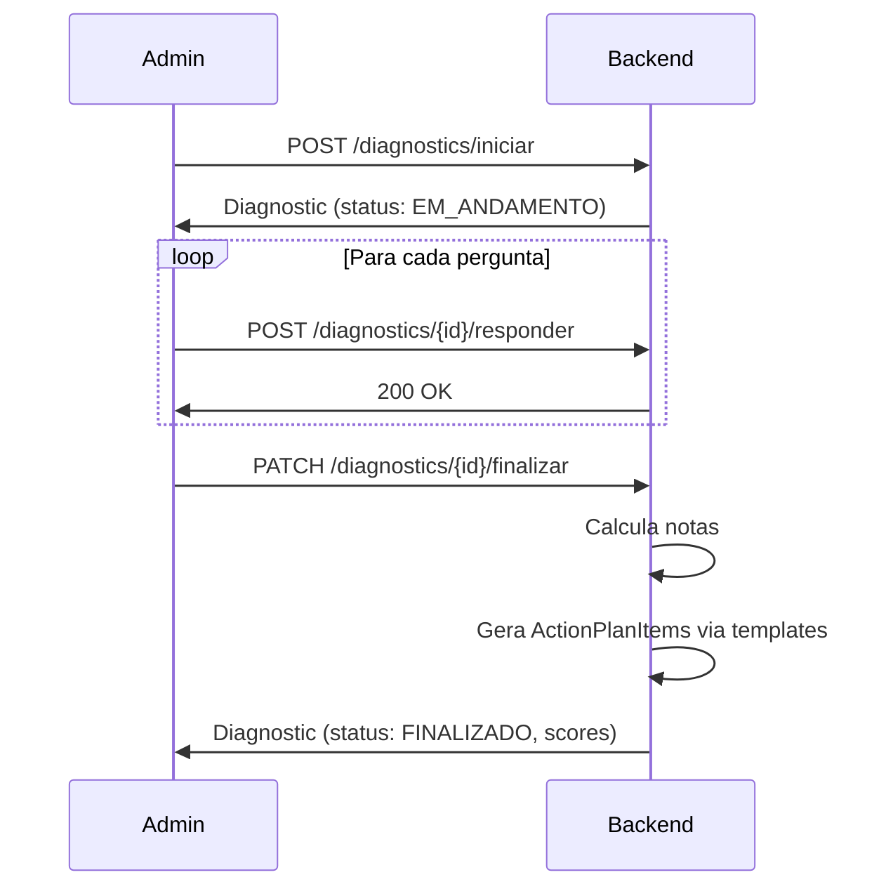

# API - Diagnostico

## Configuracao (Admin)

**Prefixo:** `/diagnostics/config`
**Autenticacao:** `ROLE_ADMIN`

### GET /diagnostics/config/pillars

Retorna todos os pilares com eixos e perguntas (estrutura completa do diagnostico).

### POST /diagnostics/config/pillars

Cria novo pilar.

### PUT /diagnostics/config/pillars/{id}

Atualiza pilar.

### POST /diagnostics/config/axes

Cria novo eixo dentro de um pilar.

### PUT /diagnostics/config/axes/{id}

Atualiza eixo.

### POST /diagnostics/config/questions

Cria nova pergunta dentro de um eixo.

**Request:**

```json
{
  "text": "A escola possui planejamento estrategico formalizado?",
  "axisId": "uuid",
  "targetAudience": "AMBOS",
  "order": 1,
  "levels": [
    { "level": 1, "description": "Nao possui planejamento" },
    { "level": 2, "description": "Possui informal" },
    { "level": 3, "description": "Possui formalizado" },
    { "level": 4, "description": "Possui com indicadores" },
    { "level": 5, "description": "Possui com revisao periodica" }
  ]
}
```

**targetAudience:** `CLUBE`, `CORP`, `START` ou `AMBOS`

### PUT /diagnostics/config/questions/{id}

Atualiza pergunta.

### DELETE /diagnostics/config/questions/{id}

Remove pergunta.

### POST /diagnostics/config/questions/{id}/duplicate

Duplica pergunta existente.

## Metodologia (Leitura)

**Prefixo:** `/methodology`
**Autenticacao:** Requerida

### GET /methodology/pillars

Retorna pilares com eixos (sem perguntas — visao da metodologia para o usuario).

## Execucao do Diagnostico

**Prefixo:** `/diagnostics`
**Autenticacao:** Requerida

### POST /diagnostics/iniciar

Inicia novo diagnostico para a escola.

**Request:**

```json
{
  "escolaId": "uuid"
}
```

### GET /diagnostics/escola/{escolaId}

Lista todos os diagnosticos da escola (historico).

### GET /diagnostics/{id}

Retorna diagnostico com todas as respostas.

### POST /diagnostics/{id}/responder

Salva resposta de uma pergunta.

**Request:**

```json
{
  "questionId": "uuid",
  "level": 3,
  "observations": "Observacao opcional"
}
```

### PATCH /diagnostics/{id}/finalizar

Finaliza o diagnostico. Calcula notas e gera plano de acao automaticamente.

**Response:** Diagnostico finalizado com notas por pilar e nota geral.

### GET /diagnostics/{id}/resultados

Retorna resultados detalhados (notas por pilar, eixo, gráfico radar).

## Fluxo do Diagnostico



## Regras de Negocio

- Perguntas filtradas por `targetAudience` de acordo com o tipo de contrato da escola
- Perguntas `AMBOS` aparecem para todos os contratos
- Nota geral = media ponderada das notas dos pilares
- Nota do pilar = media das notas dos eixos
- Nota do eixo = media dos niveis respondidos nas perguntas
- Diagnosticos ja respondidos nao sao afetados por alteracoes nas perguntas (versionamento)
