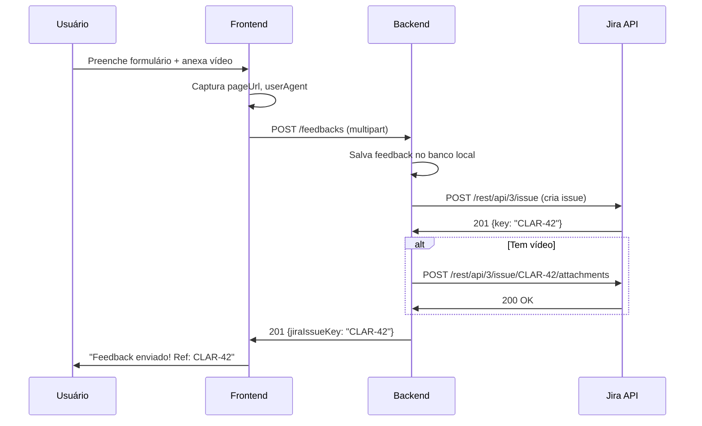

# API - Outros Endpoints

## Banners

**Prefixo:** `/banners`
**Autenticação:** Requerida

### GET /banners

Lista banners ativos (filtrados por período de exibição).

### POST /banners

Cria banner. **Admin only.**

**Request:** `multipart/form-data`

| Campo | Tipo | Descrição |
|-------|------|-----------|
| `image` | File | Imagem do banner |
| `title` | string | Título |
| `linkUrl` | string | URL de destino (opcional) |
| `startDate` | date | Data início exibição |
| `endDate` | date | Data fim exibição |
| `sortOrder` | number | Ordem no carrossel |

### PUT /banners/{id}

Atualiza banner. **Admin only.**

### DELETE /banners/{id}

Remove banner. **Admin only.**

### PATCH /banners/{id}/toggle

Ativa/desativa banner. **Admin only.**

## Eventos

**Prefixo:** `/events`
**Autenticação:** Requerida

### GET /events

Lista eventos.

### POST /events

Cria evento. **Admin only.**

**Request:**

```json
{
  "title": "Mentoria Semanal",
  "description": "Sessao de mentoria sobre estrategia",
  "startDate": "2026-04-10T14:00:00",
  "endDate": "2026-04-10T15:00:00",
  "meetingLink": "https://teams.microsoft.com/...",
  "targetSchools": ["uuid-1", "uuid-2"]
}
```

### PUT /events/{id}

Atualiza evento. **Admin only.**

### DELETE /events/{id}

Remove evento. **Admin only.**

## Leads

**Prefixo:** `/leads`

### POST /leads

Captura lead da landing page. **Público.**

**Request:**

```json
{
  "nome": "Joao Silva",
  "email": "joao@escola.com",
  "whatsapp": "61999999999",
  "escola": "Colegio Exemplo",
  "cargo": "Diretor",
  "numAlunos": "300-500",
  "produtoInteresse": "Club",
  "mensagem": "Gostaria de saber mais",
  "utmSource": "google",
  "utmMedium": "cpc",
  "utmCampaign": "gestao-escolar"
}
```

### GET /leads

Lista leads capturados. **Admin only.**

## Reports

**Prefixo:** `/reports`
**Autenticação:** `ROLE_ADMIN`

### GET /reports/dashboard

Retorna métricas do painel admin:

- Total de diagnósticos (com média de score)
- Ferramentas utilizadas
- Aulas assistidas
- Escolas ativas
- Usuários ativos

### GET /reports/escola/{escolaId}

Retorna métricas específicas de uma escola.

## App Config

**Prefixo:** `/app-config`
**Autenticação:** `ROLE_ADMIN`

### GET /app-config

Retorna configurações gerais do app.

### PUT /app-config

Atualiza configurações.

## Feedback

**Prefixo:** `/feedbacks`
**Autenticação:** Requerida

### POST /feedbacks

Envia feedback do usuário. Cria issue no Jira automaticamente se a integração estiver configurada.

**Request:** `multipart/form-data`

| Campo | Tipo | Obrigatório | Descrição |
|-------|------|-------------|-----------|
| `type` | string | Sim | `BUG` ou `SUGESTAO` |
| `title` | string | Sim | Resumo do feedback |
| `description` | string | Sim | Detalhamento |
| `pageUrl` | string | Sim | URL da página onde o usuário estava (capturada automaticamente) |
| `priority` | string | Não | `BAIXA`, `MEDIA`, `ALTA` (default: `MEDIA`) |
| `video` | File | Não | Vídeo demonstrando o bug (MP4, MOV, WebM) |

O backend captura automaticamente: `userId`, `userName`, `userEmail`, `schoolName`, `userRole`, `userAgent`.

**Response (201):**

```json
{
  "id": "uuid",
  "type": "BUG",
  "title": "Botão de salvar não funciona",
  "pageUrl": "/ferramentas/bsc",
  "jiraIssueKey": "CLAR-42",
  "jiraIssueUrl": "https://empresa.atlassian.net/browse/CLAR-42",
  "createdAt": "2026-04-07T14:30:00"
}
```

Se a integração Jira não estiver configurada, `jiraIssueKey` e `jiraIssueUrl` retornam `null` — o feedback é salvo apenas no banco local.

### GET /feedbacks

Lista feedbacks do usuário logado.

### GET /feedbacks/all

Lista todos os feedbacks de todos os usuários. **Admin only.**

**Query params:**

| Param | Tipo | Descrição |
|-------|------|-----------|
| `type` | string | Filtro: `BUG` ou `SUGESTAO` |
| `pageUrl` | string | Filtro por página de origem |
| `userId` | UUID | Filtro por usuário |

### Integração Jira — Fluxo Interno



### Configuração Jira (Admin)

**Prefixo:** `/app-config/jira`
**Autenticação:** `ROLE_ADMIN`

#### GET /app-config/jira

Retorna configuração da integração Jira (sem expor o token).

**Response (200):**

```json
{
  "jiraUrl": "https://empresa.atlassian.net",
  "jiraEmail": "servico@empresa.com",
  "jiraProjectKey": "CLAR",
  "jiraBugIssueType": "Bug",
  "jiraSuggestionIssueType": "Story",
  "configured": true
}
```

#### PUT /app-config/jira

Atualiza configuração da integração Jira.

**Request:**

```json
{
  "jiraUrl": "https://empresa.atlassian.net",
  "jiraEmail": "servico@empresa.com",
  "jiraApiToken": "token-secreto",
  "jiraProjectKey": "CLAR",
  "jiraBugIssueType": "Bug",
  "jiraSuggestionIssueType": "Story"
}
```

!!! warning "Segurança"
    O `jiraApiToken` é criptografado antes de salvar no banco. O GET nunca retorna o token — apenas indica se está configurado (`configured: true`).

#### POST /app-config/jira/test

Testa a conexão com o Jira usando as credenciais configuradas.

**Response (200):**

```json
{
  "success": true,
  "projectName": "Claraval App",
  "issueTypes": ["Bug", "Story", "Task"]
}
```

## Health Check

### GET /status

Retorna status do servidor. **Público.**

**Response (200):**

```json
{
  "status": "UP"
}
```
