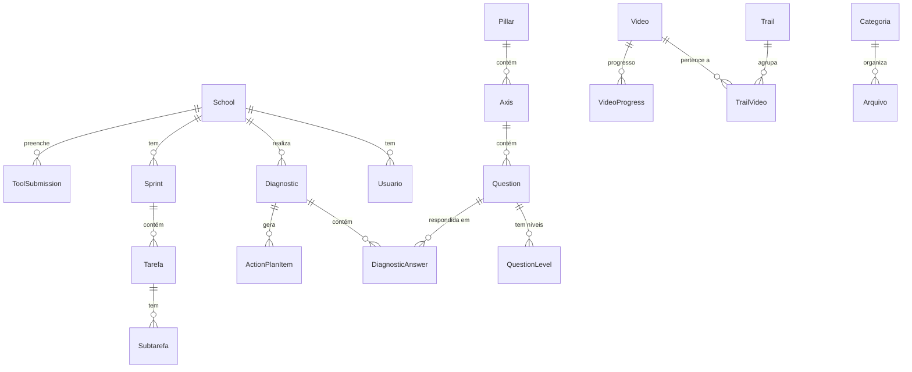

# Banco de Dados

**SGBD:** PostgreSQL
**Schema:** `claraval`
**Migrações:** Flyway (`src/main/resources/db/migration/`)
**ORM:** Spring Data JPA + Hibernate 6.6

## Entidades Principais

### Autenticação e Usuários

| Entidade | Descrição |
|----------|-----------|
| `Usuario` | Usuários do sistema (admin ou cliente). Campos: nome, email, role, escola vinculada |
| `Role` | Papéis: ROLE_ADMIN, ROLE_USER |
| `TokenSessao` | Refresh tokens para manter sessão |
| `TokenResetSenha` | Tokens de reset de senha com expiração |
| `AuditoriaLogin` | Log de tentativas de login |

### Escolas e Contratos

| Entidade | Descrição |
|----------|-----------|
| `School` | Escola cliente. Campos: nome, endereço, logo, contractType (CLUBE/CORP/START), cluster, selectedPillarId (START) |

### Diagnóstico e Metodologia

| Entidade | Descrição |
|----------|-----------|
| `Pillar` | Os 5 pilares da metodologia |
| `Axis` | Eixos dentro de cada pilar |
| `Question` | Perguntas do diagnóstico, vinculadas a um eixo |
| `QuestionLevel` | Descrição de cada nível (1-5) de cada pergunta |
| `Diagnostic` | Diagnóstico de uma escola (status, notas, data) |
| `DiagnosticAnswer` | Resposta a uma pergunta (nível selecionado, observações) |

### Plano de Ação

| Entidade | Descrição |
|----------|-----------|
| `ActionPlanItem` | Item do plano de ação (descrição, prioridade, status, pilar, eixo) |
| `ActionPlanTemplate` | Template para geração automática de itens |

### Ferramentas

| Entidade | Descrição |
|----------|-----------|
| `Tool` | Ferramenta de gestão (tipo: TEMPLATE, SCORE, CHECKLIST) |
| `ToolSubmission` | Preenchimento de uma ferramenta por escola (versionado, JSON) |

### E-Learning

| Entidade | Descrição |
|----------|-----------|
| `Video` | Vídeo com título, descrição, pilar, cluster, provider |
| `VideoProgress` | Progresso de visualização por usuário (PK composta: VideoProgressPK) |
| `Trail` | Trilha de aprendizado |
| `TrailVideo` | Relação N:N entre Trail e Vídeo (com ordem) |

### Tarefas e Sprints

| Entidade | Descrição |
|----------|-----------|
| `Sprint` | Sprint da escola (nome, datas, tamanho, status) |
| `Tarefa` | Tarefa vinculada a sprint ou plano CLA |
| `Subtarefa` | Subtarefas dentro de uma tarefa |
| `TarefaHistorico` | Histórico de alterações de status |

### Documentos

| Entidade | Descrição |
|----------|-----------|
| `Categoria` | Categoria de documento vinculada a um pilar |
| `Arquivo` | Documento enviado pela escola |
| `SharedDocument` | Documentos compartilhados (com folders) |
| `DocumentFolder` | Pastas para organização de documentos |

### Outros

| Entidade | Descrição |
|----------|-----------|
| `Banner` | Banners do carrossel do dashboard |
| `Event` | Eventos/encontros agendados |
| `Lead` | Leads capturados pela landing page |
| `AppConfig` | Configurações gerais do app |
| `DiagnosticPriority` | Prioridades customizadas por tipo de contrato |
| `DiagnosticSession` | Sessões de preenchimento compartilhado |

## Diagrama ER Simplificado

## Convenções

- **IDs**: UUID em todas as entidades
- **BaseEntity**: Classe base no pacote `newversion/model/` com campos comuns
- **Toggleable**: Interface para entidades com campo `active` (uso com `EntityHelper.toggleActive()`)
- **Schema**: Todas as tabelas no schema `claraval`
- **Nomenclatura DB**: Colunas em português (legado), migrando para inglês no pacote `newversion`
