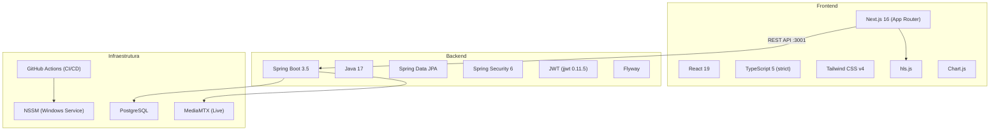

# Visão Geral da Arquitetura

## Stack



## Decisões Arquiteturais

### Frontend: Hooks + Context (sem Redux)

A aplicação não tem estado global complexo. Apenas dois dados precisam ser compartilhados globalmente: **usuário logado** e **escola selecionada**. Cada feature é isolada — diagnóstico não precisa saber do e-learning.

| Context | Arquivo | Propósito |
|---------|---------|-----------|
| `AuthProvider` | `hooks/useAuth.tsx` | Usuário logado, tokens, login/logout, `isAdmin` |
| `SchoolProvider` | `hooks/useSchool.tsx` | Escola selecionada, lista de escolas, tipo de contrato |

### Backend: Arquitetura em Camadas

```
Controller → Service → Repository → Entity
```

Padrão clássico Spring Boot com separação clara de responsabilidades. Dois pacotes coexistem:

- `app/` — pacote legado (auth, arquivos, usuários)
- `newversion/` — pacote atual com toda a lógica de domínio

### Autenticação: JWT Stateless

```
Login (email/senha ou Google OAuth)
  → Backend valida e retorna accessToken + refreshToken
    → Tokens salvos no localStorage (frontend)
      → AuthProvider carrega perfil do usuário
        → Layouts protegidos verificam useAuth()
```

Proteção de rotas é **client-side** (nos layouts), não via middleware do Next.js. O middleware roda no Edge Runtime, que não tem acesso a `localStorage`.

### Comunicação: REST + Fetch Nativo

Frontend usa wrapper customizado sobre `fetch` (sem Axios):

| Feature | Detalhe |
|---------|---------|
| Auth automática | Bearer token injetado em toda request |
| Token refresh | Na 401, tenta refresh e retenta request original |
| Retry (GET) | 3 tentativas com backoff exponencial (1s) |
| Retry (mutação) | Sem retry (POST/PUT/DELETE) |
| Upload | `api.upload()` (FormData) e `api.uploadWithProgress()` (XHR) |

### Streaming de Vídeo

- **VOD**: Upload direto de arquivos (MP4, MOV, WebM, AVI) com streaming HTTP Range
- **Live**: Professor transmite via OBS (RTMP) → MediaMTX converte para HLS → Frontend reproduz com hls.js

<!-- TODO: Screenshot do diagrama de sequência do fluxo de autenticação — útil para entender o ciclo completo do JWT -->
