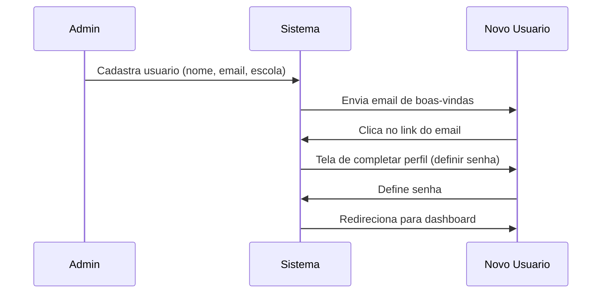
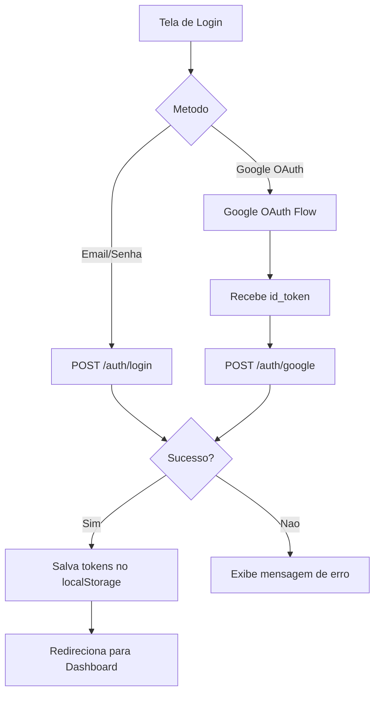
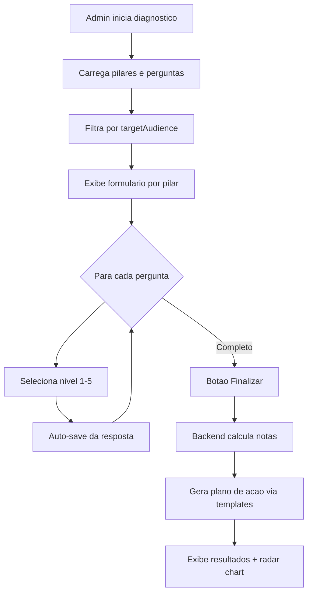
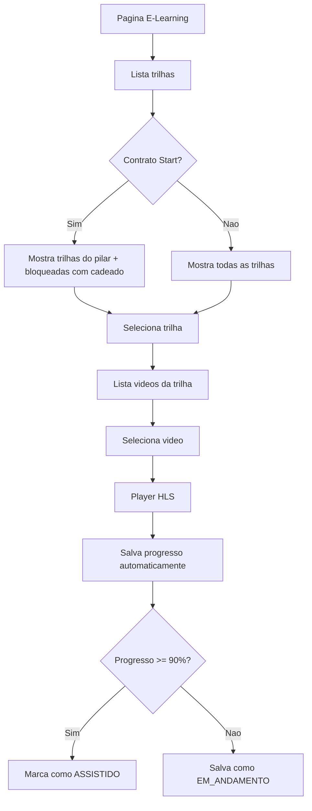
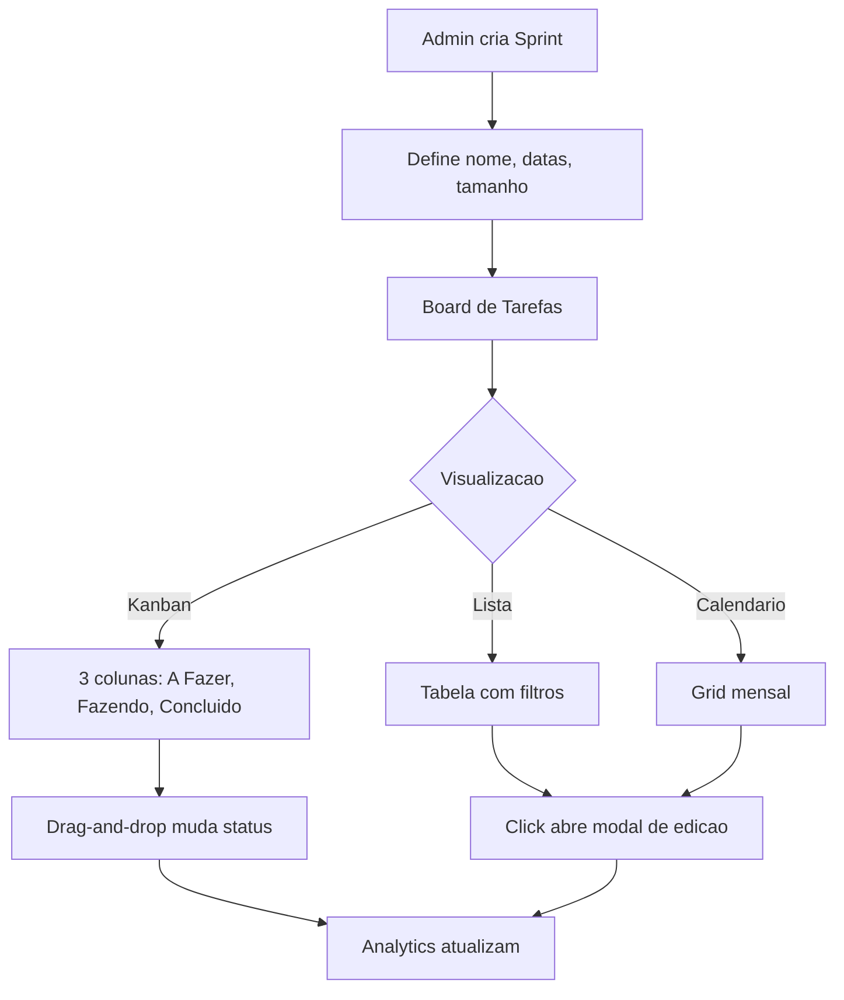
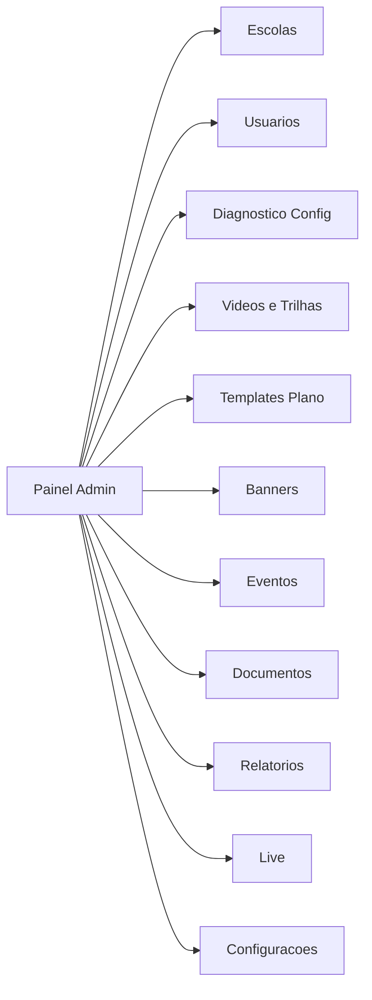
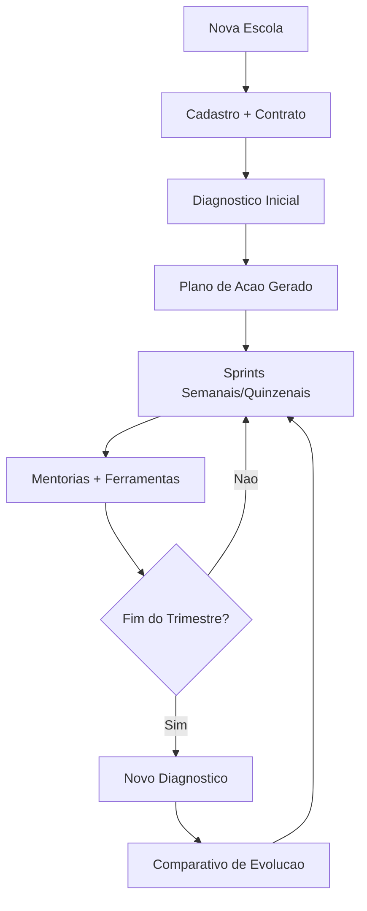

# Jornadas de Usuario

## 1. Primeiro Acesso

## 2. Login

## 3. Diagnostico de Maturidade

## 4. E-Learning

## 5. Tarefas e Sprints

## 6. Fluxo Admin — Gestao de Conteudo

## 7. Ciclo de Trabalho da Consultoria

<!-- TODO: Screenshots das telas principais de cada jornada — ajuda muito na contextualizacao visual para novos devs -->
